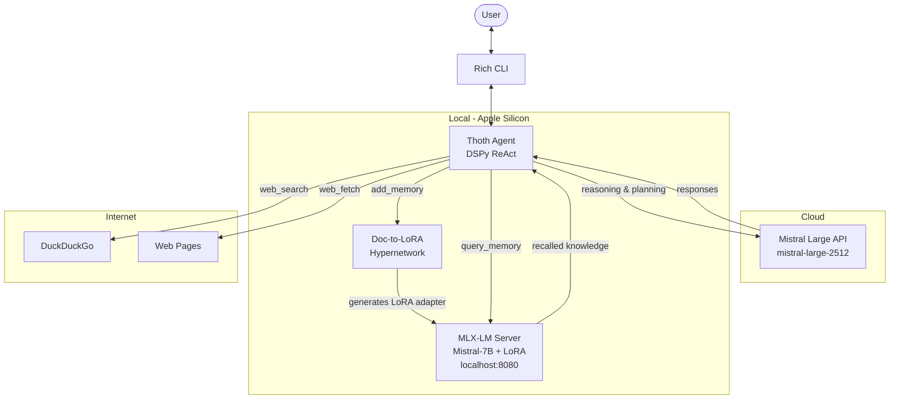

# Thoth

> Built for the [Mistral AI Worldwide Hackathon 2026](https://worldwide-hackathon.mistral.ai/)

The LoRA-memory powered coding agent.

Instead of feeding entire documents into the context window, Thoth converts them into LoRA adapters on the fly using [Sakana.ai's Doc-to-LoRA](https://pub.sakana.ai/doc-to-lora/), freeing up context for reasoning and conversation while retaining document knowledge in the model's weights.

## How it works

Thoth is a [DSPy](https://dspy.ai/) ReAct agent powered by Mistral Large, with access to four tools:

| Tool           | Description                                                                                     |
| -------------- | ----------------------------------------------------------------------------------------------- |
| `add_memory`   | Converts text into a LoRA adapter via Doc-to-LoRA and loads it into a local Mistral-7B instance |
| `query_memory` | Queries the LoRA-augmented local model to recall stored knowledge                               |
| `web_search`   | Searches the web via DuckDuckGo                                                                 |
| `web_fetch`    | Fetches and extracts clean content from a URL                                                   |

The agent prioritizes querying memory before searching the web, and adds new learnings to memory before finishing each task.

### The Doc-to-LoRA pipeline

1. A pretrained [hypernetwork](https://arxiv.org/abs/2602.15902) encodes the document through Mistral-7B to extract per-layer hidden states
2. A Perceiver Resampler compresses the document tokens into 8 latent vectors
3. The HyperLoRA network generates LoRA A/B weight matrices from these latents
4. The adapter is saved in MLX format and loaded into a local Mistral-7B-Instruct server

This means document knowledge lives in the model weights rather than the context window.

### `thoth/d2l` — standalone Doc-to-LoRA library

The `thoth/d2l` module is a custom implementation of Doc-to-LoRA for MLX, enabling on-device LoRA generation on Apple Silicon. It runs inference over the Doc-to-LoRA hypernetwork to generate LoRA adapters from documents, and can be used independently of the Thoth agent:

```python
from thoth.d2l.doc_to_lora import process_doc_to_lora

process_doc_to_lora("Your document text here", output_dir="./my_adapter")
```

This downloads the pretrained hypernetwork checkpoint, encodes the document through Mistral-7B, generates LoRA weights, and saves them as an MLX-compatible adapter ready to be loaded by `mlx_lm`.

### Related: [Neopolita/doc-to-lora](https://github.com/Neopolita/doc-to-lora)

Also part of this hackathon submission, the [doc-to-lora](https://github.com/Neopolita/doc-to-lora) repository contains the training code to train a Doc-to-LoRA hypernetwork for [Ministral-3-3B-Instruct-2512](https://huggingface.co/mistralai/Ministral-3-3B-Instruct-2512). While Thoth uses a pretrained hypernetwork for Mistral-7B at inference time, that repository provides the tools to train new hypernetworks from scratch for different models.

## Architecture



## Setup

Requires Python 3.12+, [uv](https://docs.astral.sh/uv/), and Apple Silicon (for local MLX inference).

```bash
# Install dependencies
uv sync

# Set your Mistral API key
export MISTRAL_API_KEY=your_key_here

# Run
python main.py
```

## Commands

| Command              | Description                               |
| -------------------- | ----------------------------------------- |
| `/add_memory <text>` | Manually add data to memory               |
| `/clear_memory`      | Clear all stored memory and LoRA adapters |
| `quit` / `exit`      | Exit the app                              |

## Tech stack

- **[Mistral Large](https://mistral.ai/)** — main reasoning LLM
- **[DSPy](https://dspy.ai/)** — agent framework (ReAct architecture)
- **[MLX-LM](https://github.com/ml-explore/mlx-examples)** — local inference with LoRA adapters on Apple Silicon
- **[PEFT](https://github.com/huggingface/peft)** — parameter-efficient fine-tuning
- **[Doc-to-LoRA](https://github.com/SakanaAI/Doc-to-LoRA)** — document-to-LoRA hypernetwork by Sakana.ai
- **[Rich](https://github.com/Textualize/rich)** — terminal UI
- **[DDGS](https://github.com/deedy5/ddgs)** — web search
- **[Trafilatura](https://github.com/adbar/trafilatura)** — web content extraction

## Project structure

```
thoth/
├── main.py              # App entry point and conversation loop
├── thoth/
│   ├── signatures.py    # DSPy agent signatures
│   ├── tools.py         # Web search and fetch tools
│   ├── memory.py        # Memory management and MLX server
│   ├── display.py       # Terminal UI (gradient logo, stats)
│   ├── utils.py         # Token counting, truncation, log suppression
│   ├── logger.py        # Logging config
│   └── d2l/
│       ├── doc_to_lora.py  # HyperLoRA pipeline
│       └── common.py       # MLX adapter serialization
└── data/
    ├── context.md       # System instructions for the agent
    └── logo.txt         # ASCII art logo
```

### Why Not RAG?

|                     | Doc-to-LoRA                                       | RAG                                       |
| ------------------- | ------------------------------------------------- | ----------------------------------------- |
| **Context window**  | Free -- knowledge lives in LoRA weights           | Consumed by retrieved chunks              |
| **Latency**         | Sub-second LoRA generation, then normal inference | Retrieval + reranking at every query      |
| **Knowledge depth** | Full document absorbed into weights               | Limited to retrieved snippets             |
| **Composability**   | Multiple document LoRAs can be composed           | Context window limits how many chunks fit |
| **Trade-off**       | Requires training a hypernetwork                  | Works out of the box with any LLM         |

Doc-to-LoRA is complementary to RAG -- it works best for documents that are queried repeatedly, where the upfront cost of LoRA generation pays off across many queries.

## References

- [Doc-to-LoRA paper](https://arxiv.org/abs/2602.15902)
- [Sakana.ai blog post](https://pub.sakana.ai/doc-to-lora/)
- [Doc-to-LoRA repo](https://github.com/SakanaAI/Doc-to-LoRA)

## Citation

```bibtex
@article{doc-to-lora,
  title={Doc-to-LoRA: Sub-Second Knowledge Injection into LLMs via Document-to-LoRA Translation},
  author={Sakana AI},
  year={2026},
  url={https://pub.sakana.ai/doc-to-lora/}
}
```